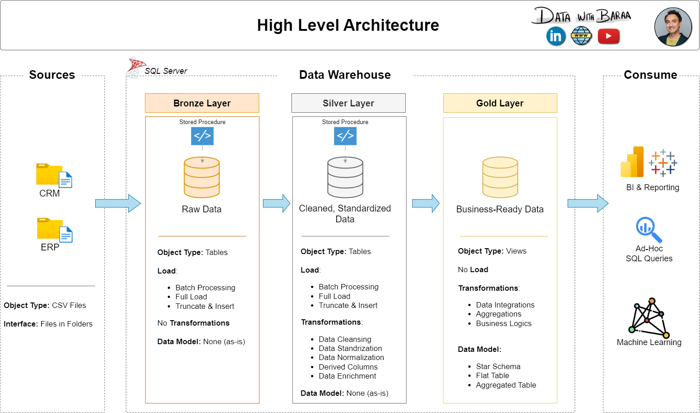

Here is the updated `README.md` file, incorporating the data architecture and ETL methodology diagrams. I have formatted the image paths to point directly to the `docs/` folder as you requested. 

***

```markdown
# SQL Data Warehouse Architecture and ETL Engineering Project

**Overview:** 
This project focuses on developing a modern data warehouse using SQL Server to consolidate sales data, enabling analytical reporting and informed decision-making. It implements a comprehensive ETL (Extract, Transform, Load) pipeline that transforms messy, raw data into a structured **Star Schema** data model explicitly designed for business intelligence. 

### **High-Level Data Architecture**



The data warehouse strictly follows the **Medallion architecture**, breaking down the system into three distinct layers to ensure a separation of concerns. As shown in the architecture diagram, the data flows from raw CSV files into the warehouse and eventually out to consumers for BI, machine learning, and ad-hoc queries:

*   **Bronze Layer:** This landing zone stores raw, unmanipulated data exactly as it arrives from the CRM and ERP source systems. Keeping the data untouched ensures full traceability and assists data engineers in root-cause analysis. Data is ingested via a full load process (TRUNCATE and INSERT) using `BULK INSERT` for maximum speed. 
*   **Silver Layer:** This is where the heavy lifting of data cleansing occurs, providing clean and standardized data in table format. Transformations in this layer include trimming unwanted spaces, normalizing coded abbreviations to friendly values, handling missing data (replacing NULLs with defaults like "Not Available"), and deriving new columns.
*   **Gold Layer:** The final layer provides business-ready data structured specifically for analytics and reporting. It is built virtually using SQL **Views** to remain dynamic and fast, meaning there is no physical load process. This layer utilizes a **Star Schema** consisting of Dimension tables (Customers, Products) and a Fact table (Sales) linked together using unique, system-generated surrogate keys.

### **ETL Methodology**


The project utilizes robust ETL techniques to process and load the data:
*   **Extraction:** Data is pulled via full extraction by parsing CSV files sourced from the CRM and ERP systems. 
*   **Transformation:** The pipeline applies a variety of transformation rules, including data cleansing (handling invalid or missing values, casting data types, detecting outliers), data normalization, and implementing business logic.
*   **Load:** The warehouse is updated using Batch Processing with a Full Load method (Truncate & Insert) to refresh the Bronze and Silver layers.

### **Data Sources**
The project integrates and merges data from two distinct source systems, both provided as CSV files:
*   **CRM (Customer Relationship Management):** Provides core tables for customer info, product info, and transactional sales details.
*   **ERP (Enterprise Resource Planning):** Provides supplementary details including customer locations, birth dates, and product categories.

### **Tech Stack & Tools**
*   **SQL Server Express & SSMS:** Used as the primary database engine and client to run queries and host the warehouse.
*   **Git & GitHub:** For version control and storing the project repository.
*   **Draw.io:** Utilized to design the Data Architecture, Data Flow/Lineage, and Logical Data Model diagrams.
*   **Notion:** Used to organize project epics, task tracking, and the overall project plan.

### **Repository Structure**
The project directory is structured logically to separate data, code, and documentation:
*   `/data_sets/`: Contains the original raw CSV files from the ERP and CRM sources.
*   `/scripts/`: Contains the core SQL files, organized internally into `/bronze/`, `/silver/`, and `/gold/` folders. This includes the DDL (Data Definition Language) to create schemas/tables and the Stored Procedures that handle the ETL processes.
*   `/tests/`: Contains SQL quality check scripts built to validate data uniqueness, correct data types, and integration logic across the layers.
*   `/docs/`: Contains visual documentation including the `data_architecture.png` and `ETL.png` diagrams.

### **Key Design Principles**
*   **Naming Conventions:** The project strictly follows the **snake_case** convention across all files. Bronze and Silver tables use a `SourceSystem_EntityName` pattern (e.g., `crm_cust_info`), while the Gold layer uses business-aligned prefixes (e.g., `dim_customers`, `fact_sales`).
*   **Error Handling & ETL Auditing:** Stored procedures managing the pipelines are wrapped in `TRY/CATCH` blocks for robust error handling. They also utilize `GETDATE()` and `DATEDIFF()` variables to calculate and print the load duration of each table and the complete batch, helping to identify performance bottlenecks.
*   **Metadata Tracking:** Technical metadata columns (like `dw_create_date`) are appended during the Silver layer load to track exactly when records were processed.
*   **License:** This project is licensed under the **MIT License**, granting full freedom to use, modify, and share the code.
```
